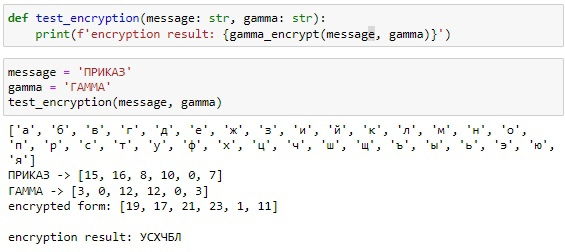

---
# Front matter
lang: ru-RU
title: Защита лабораторной работы №3
subtitle: Шифрование гаммированием 
author: "Бурдина К. П."
institute: Российский университет дружбы народов, Москва, Россия
date: 13 октября 2023

# Formatting
toc: false
slide_level: 2
header-includes: 
 - \metroset{progressbar=frametitle,sectionpage=progressbar,numbering=fraction}
 - '\makeatletter'
 - '\beamer@ignorenonframefalse'
 - '\makeatother'
aspectratio: 43
section-titles: true
theme: metropolis

---

## Докладчик

:::::::::::::: {.columns align=center}
::: {.column width="70%"}

    * Бурдина Ксения Павловна
    * студентка группы НФИмд-02-23
    * студ. билет № 1132236896
    * Российский университет дружбы народов
    * 1132236896@rudn.ru

:::
::: {.column width="30%"}

:::
::::::::::::::

# Вводная часть 

## Цель выполнения лабораторной работы

- Освоение шифрования гаммированием
- Программная реализация алгоритма ширования гаммированием конечной гаммой

## Теоретические сведения

Гаммирование - процедура наложения при помощи некоторой функции $F$ на исходный текст гаммы шифра, то есть псевдослучайной последовательности (ПСП) с выходом генератора $G$. Псевдослучайная последовательность по своим статистическим свойствам неотличима от случайной последовательности, но является детерминированной, то есть известен алгоритм ее формирования.

{width=70%}

## Теоретические сведения

Простейший генератор псевдослуайной последовательности можно представить рекуррентным соотношением:
$$\gamma _i = a*\gamma _{i-1} + b*mod(m), i = \overline{1,m}$$

Для достижения максимальной длины периода необходимо удовлетворить следующим условиям:

- b и m - взаимно простые числа;
- a-1 делится на любой простой делитель числа m;
- a-1 кратно 4, если m кратно 4.

# Результат выполнения лабораторной работы

## Результат выполнения лабораторной работы

Постановка задачи:

1. Рализовать шифрование гаммированием конечной гаммой

## Результат выполнения лабораторной работы

Алгоритм поиска зашифрованного текста на основе принципа формирования шифрования гаммирования:

{width=70%}

## Результат выполнения лабораторной работы

Нахождение зашифрованного текста с данными из примера:

{width=80%}

## Результат выполнения лабораторной работы

Результат работы при вводе исходного текста на русском языке:

{width=80%}

## Результат выполнения лабораторной работы

Результат работы при вводе исходного текста на английском языке:

{width=80%}

# Выводы

## Выводы

1. Изучили шифрование гаммированием
2. Реализовали алгоритм шифрования гаммированием конечной гаммой
